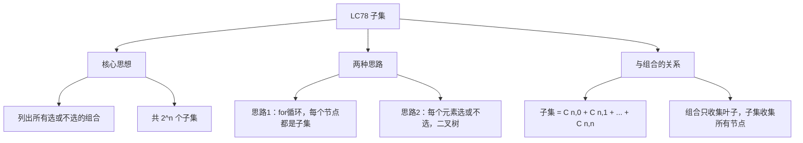
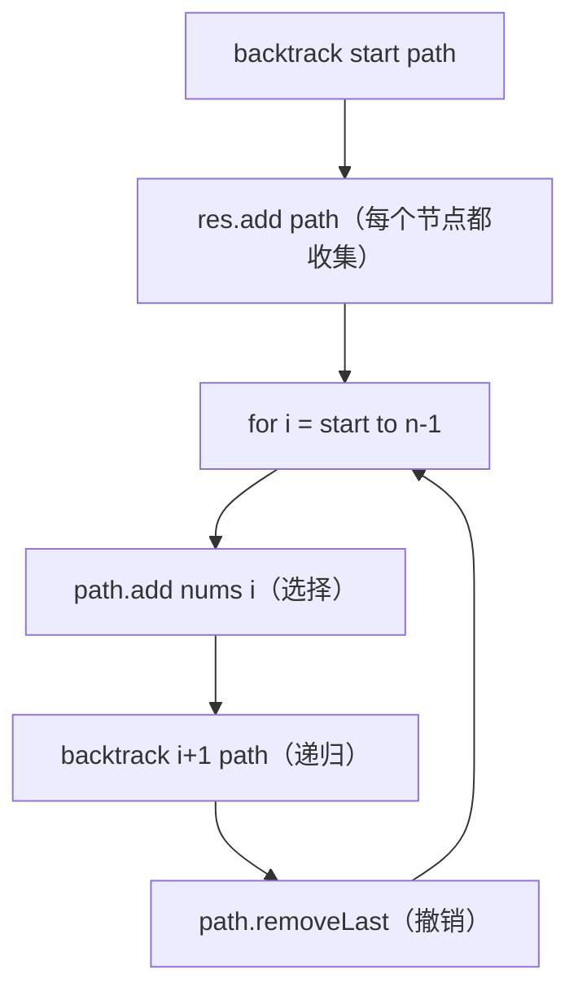

# LC78 子集
## 一、题目描述
给你一个整数数组 `nums`，数组中的元素**互不相同**。返回该数组所有可能的**子集**（幂集）。解集不能包含重复的子集，可以按任意顺序返回。
**示例：**
```
输入：nums = [1,2,3]
输出：[[],[1],[2],[1,2],[3],[1,3],[2,3],[1,2,3]]
共 2^3 = 8 个子集（包括空集和全集）
```
**约束：**
- 1 <= nums.length <= 10
- nums 中的所有元素互不相同
---
## 二、解法概览
### 解法对比表
| 解法 | 时间复杂度 | 空间复杂度 | 面试推荐 |
|------|-----------|-----------|---------|
| **回溯（for循环，每个节点收集）** | O(n×2^n) | O(n) | ✅ **首选（通用模板）** |
| 回溯（选或不选，二叉树） | O(n×2^n) | O(n) | ✅ 推荐 |
### 与排列、组合的区别
```
排列（LC46）：选n个，关心顺序 → for从0+used，叶子收集
组合（LC77）：选k个，不关心顺序 → for从start，叶子收集
子集（LC78）：选0~n个，不关心顺序 → for从start，每个节点都收集
子集 = 所有大小的组合的并集
```
### 思维导图

---
## 三、记忆口诀
```
子集回溯每个收，不只叶子全要有
for从start不回头，和组合框架一样走
区别只在收集时，组合等满子集即收
```
---
## 四、解法一：回溯 for 循环版（首选 ✅ 通用模板）
### 思路
和组合（LC77）的框架**完全一样**，唯一区别：**每个节点都收集结果**，不是只在叶子节点收集。
### 核心公式
```
backtrack(start, path):
  res.add(new ArrayList<>(path))    ← 每个节点都收集！（和组合的唯一区别）
  for i = start to n-1:
    path.add(nums[i])
    backtrack(i + 1, path)
    path.removeLast()
```
### 和组合（LC77）的代码对比
```java
// LC77 组合：只在叶子收集
void backtrack(int start, List<Integer> path) {
    if (path.size() == k) {                // ← 选够k个才收集
        res.add(new ArrayList<>(path));
        return;
    }
    for (int i = start; ...) { ... }
}
// LC78 子集：每个节点都收集
void backtrack(int start, List<Integer> path) {
    res.add(new ArrayList<>(path));         // ← 进来就收集！
    for (int i = start; ...) { ... }
}
```
> 区别就一行：组合是 `if (size==k)` 才收集，子集是**进来就收集**。
### 图解过程（决策树）
```
nums = [1, 2, 3]
                      [] ← 收集
           /           |          \
         [1] ← 收集  [2] ← 收集  [3] ← 收集
        /    \          |
    [1,2]   [1,3]     [2,3]
   ← 收集  ← 收集    ← 收集
      |
   [1,2,3] ← 收集
每个节点（不只是叶子）都是一个子集！
收集顺序：[], [1], [1,2], [1,2,3], [1,3], [2], [2,3], [3]
共 8 个 = 2^3 ✅
```
### 算法流程图

### 代码示例
```java
public List<List<Integer>> subsets(int[] nums) {
    List<List<Integer>> res = new ArrayList<>();
    List<Integer> path = new ArrayList<>();
    backtrack(nums, 0, path, res);
    return res;
}
private void backtrack(int[] nums, int start,
                       List<Integer> path, List<List<Integer>> res) {
    res.add(new ArrayList<>(path));  // 每个节点都收集
    for (int i = start; i < nums.length; i++) {
        path.add(nums[i]);                       // 选择
        backtrack(nums, i + 1, path, res);        // 递归
        path.remove(path.size() - 1);             // 撤销
    }
}
```
### 复杂度分析
- 时间复杂度：**O(n × 2^n)**，2^n 个子集，每个复制 O(n)
- 空间复杂度：**O(n)**，path + 递归栈
### 优缺点
| 优点 | 缺点 |
|-----|------|
| 通用模板，排列组合子集一个框架 | 无 |
| 和组合只差一行 | 无 |
---
## 五、解法二：选或不选（二叉树，你的代码）
### 思路
换一种角度：对每个元素做一个**二选一的决策**——选它或不选它。递归到底（所有元素都决策过了），就是一个子集。
### 核心公式
```
helper(index, subset):
  if index == n → 收集subset（到底了，所有元素都决策过了）
  不选nums[index] → helper(index+1, subset)
  选nums[index] → subset.add → helper(index+1, subset) → subset.removeLast
```
### 怎么理解？
```
每个元素面前有两条路：选 or 不选
nums = [1, 2, 3]
                          []
                    不选1 /  \ 选1
                     []       [1]
                不选2/\选2  不选2/\选2
                []  [2]   [1] [1,2]
              不/\选 ...   ...  ...
             [] [3] ...        ...
到达叶子节点时（index==n），所有元素都决策过了
叶子节点就是所有子集
2个选择 × 3个元素 = 2^3 = 8 个叶子 = 8 个子集
```
### 图解过程（二叉决策树）
```
nums = [1, 2, 3]
                             {}
                       /            \
                 不选1 {}           选1 {1}
                /       \         /       \
          不选2 {}    选2 {2}  不选2 {1}  选2 {1,2}
           / \       / \       / \        / \
      不3{} 选3{3} {2} {2,3} {1} {1,3} {1,2} {1,2,3}
       ↑     ↑     ↑    ↑    ↑    ↑     ↑      ↑
      叶子节点 = 8个子集
```
### 代码示例（你的代码优化版）
```java
public List<List<Integer>> subsets(int[] nums) {
    List<List<Integer>> res = new ArrayList<>();
    helper(nums, 0, new ArrayList<>(), res);
    return res;
}
private void helper(int[] nums, int index,
                    List<Integer> subset, List<List<Integer>> res) {
    // 到底了，所有元素都决策过了
    if (index == nums.length) {
        res.add(new ArrayList<>(subset));
        return;
    }
    // 不选当前元素
    helper(nums, index + 1, subset, res);
    // 选当前元素
    subset.add(nums[index]);
    helper(nums, index + 1, subset, res);
    // 回溯
    subset.remove(subset.size() - 1);
}
```
### 复杂度分析
- 时间复杂度：**O(n × 2^n)**
- 空间复杂度：**O(n)**
### 优缺点
| 优点 | 缺点 |
|-----|------|
| "选或不选"思路直观 | 不是通用模板 |
| 二叉决策树清晰 | 不好扩展到排列组合 |
---
## 六、两种解法对比
| 对比 | for循环版 | 选或不选版 |
|------|----------|-----------|
| 决策树形状 | 多叉树 | 二叉树 |
| 收集时机 | 每个节点 | 只在叶子 |
| 通用性 | **通用**（排列组合子集统一模板） | 只适合子集 |
| 代码 | 更简洁 | 更直观 |
| 面试推荐 | **首选** | 追问时提 |
---
## 七、排列/组合/子集 三合一对比
```java
// 排列（LC46）                   // 组合（LC77）                   // 子集（LC78）
void bt(path, used) {             void bt(start, path) {            void bt(start, path) {
  if (size==n) 收集;                if (size==k) 收集;                收集;  ← 每个节点
  for (i=0;i<n;i++) {               for (i=start;i<=n;i++) {         for (i=start;i<n;i++) {
    if (used[i]) continue;            add; bt(i+1); remove;            add; bt(i+1); remove;
    add; used=T; bt; remove; used=F;  }                                }
  }                                 }                                }
}                                 }                                }
```
| 区别 | 排列 | 组合 | 子集 |
|------|------|------|------|
| for起点 | 0 | start | start |
| 防重复 | used | 天然 | 天然 |
| 收集时机 | size==n | size==k | **每个节点** |
---
## 八、面试回答模板
### 1. 开场：理解题意
> 返回数组的所有子集，包括空集和全集，共 2^n 个。
### 2. 思路：回溯
> 和组合的回溯框架完全一样，for 从 start 开始只往后选。唯一区别是**每个节点都收集结果**，不只是叶子。因为空集、选1个、选2个...选n个，每种大小的组合都是子集。
### 3. 和组合的关系
> 子集 = 所有大小的组合的并集。组合只收集 `path.size()==k` 的叶子，子集收集所有节点。
### 4. 复杂度
> 时间 O(n×2^n)，空间 O(n)。
---
## 九、相关题目
| 题号 | 题目 | 关系 | 难度 |
|-----|------|------|-----|
| LC90 | 子集II | 有重复元素，需剪枝 | 中等 |
| LC77 | 组合 | 子集的固定大小版 | 中等 |
| LC46 | 全排列 | 排列版回溯 | 中等 |
| LC39 | 组合总和 | 组合+可重复选 | 中等 |
| LC784 | 字母大小写全排列 | 选或不选变体 | 中等 |