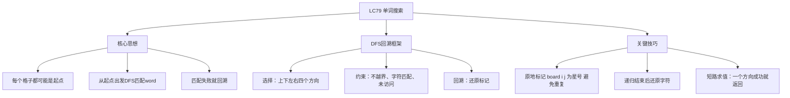
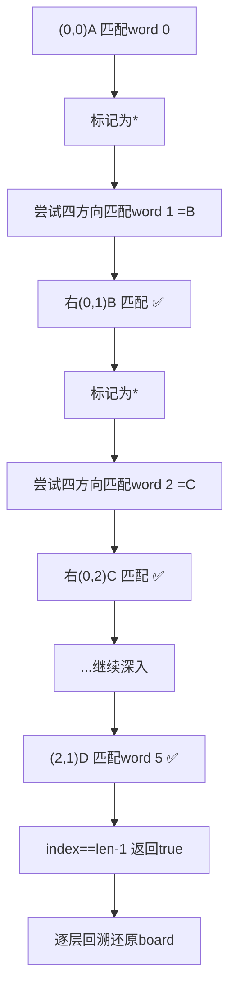

# LC79 单词搜索
## 一、题目描述
给定一个 `m x n` 二维字符网格 `board` 和一个字符串单词 `word`。如果 `word` 存在于网格中，返回 `true`；否则返回 `false`。
单词必须按照字母顺序，通过相邻的单元格（水平或垂直相邻）内的字母构成。同一个单元格内的字母**不允许被重复使用**。
**示例1：**
```
board = [["A","B","C","E"],
         ["S","F","C","S"],
         ["A","D","E","E"]]
word = "ABCCED" → true
路径：A → B → C → C → E → D
  [A] [B] [C]  E
   S   F  [C]  S
   A  [D] [E]  E
```
**示例2：**
```
word = "SEE" → true
路径：S → E → E
   A   B   C   E
   S   F   C  [S]
   A   D  [E] [E]
```
**示例3：**
```
word = "ABCB" → false
B 已经用过了，不能重复走
```
**约束：**
- m == board.length，n == board[i].length
- 1 <= m, n <= 6
- 1 <= word.length <= 15
---
## 二、解法概览
### 解法对比表
| 解法 | 时间复杂度 | 空间复杂度 | 面试推荐 |
|------|-----------|-----------|---------|
| **DFS + 回溯** | O(m×n×3^L) | O(L) | ✅ **标准解法** |
### 思维导图

---
## 三、记忆口诀
```
单词搜索用DFS，每个格子试起点
上下左右四方向，字符匹配才深入
星号标记防重复，回溯还原是关键
匹配完了返回真，有一条路就够了
```
---
## 四、解法：DFS + 回溯
### 思路
1. **枚举起点**：遍历网格每个位置，作为单词的第一个字符尝试匹配
2. **DFS递归**：从起点出发，向上下左右四个方向递归，逐个匹配 word 的字符
3. **回溯**：走过的格子标记为 `*` 防止重复访问，递归返回后还原
### 核心公式
```
dfs(i, j, index):
  终止条件1：越界 或 字符不匹配 → return false
  终止条件2：index == word.length()-1 → return true（全部匹配完）
  标记当前格子为 '*'（防重复）
  向四个方向递归 dfs(上,下,左,右, index+1)
  还原当前格子（回溯）
  返回四个方向中任意一个为 true 即可
```
### 为什么用 `*` 标记而不用 visited 数组？
```
方式一：boolean[][] visited = new boolean[m][n]
  需要 O(m×n) 额外空间
方式二：board[i][j] = '*'（原地修改）
  不需要额外空间，递归回来后还原即可
  因为 '*' 不会出现在 word 中，所以标记后该格子一定不匹配
两种方式都正确，原地标记更省空间
```
### 图解过程
```
board:                  word = "ABCCED"
  A  B  C  E
  S  F  C  S
  A  D  E  E
━━━━━━━━━━━━━━━━━━━━━━━━━━━━━━━━━━
枚举起点：(0,0) board[0][0]='A' == word[0]='A' ✅ 进入DFS
━━━━━━━━━━━━━━━━━━━━━━━━━━━━━━━━━━
DFS第0层：(0,0)='A'，匹配word[0]='A' ✅
  标记 board[0][0]='*'
  board: *  B  C  E
         S  F  C  S
         A  D  E  E
  向四个方向尝试匹配 word[1]='B'
    上(-1,0)：越界 ❌
    下(1,0)：board[1][0]='S' != 'B' ❌
    左(0,-1)：越界 ❌
    右(0,1)：board[0][1]='B' == 'B' ✅ → 递归
━━━━━━━━━━━━━━━━━━━━━━━━━━━━━━━━━━
DFS第1层：(0,1)='B'，匹配word[1]='B' ✅
  标记 board[0][1]='*'
  board: *  *  C  E
         S  F  C  S
         A  D  E  E
  尝试匹配 word[2]='C'
    上(-1,1)：越界 ❌
    下(1,1)：board[1][1]='F' != 'C' ❌
    左(0,0)：board[0][0]='*' != 'C' ❌ ← 标记起了作用！
    右(0,2)：board[0][2]='C' == 'C' ✅ → 递归
━━━━━━━━━━━━━━━━━━━━━━━━━━━━━━━━━━
DFS第2层：(0,2)='C'，匹配word[2]='C' ✅
  标记 board[0][2]='*'
  尝试匹配 word[3]='C'
    下(1,2)：board[1][2]='C' == 'C' ✅ → 递归
━━━━━━━━━━━━━━━━━━━━━━━━━━━━━━━━━━
DFS第3层：(1,2)='C'，匹配word[3]='C' ✅
  标记 board[1][2]='*'
  尝试匹配 word[4]='E'
    下(2,2)：board[2][2]='E' == 'E' ✅ → 递归
━━━━━━━━━━━━━━━━━━━━━━━━━━━━━━━━━━
DFS第4层：(2,2)='E'，匹配word[4]='E' ✅
  标记 board[2][2]='*'
  尝试匹配 word[5]='D'
    左(2,1)：board[2][1]='D' == 'D' ✅ → 递归
━━━━━━━━━━━━━━━━━━━━━━━━━━━━━━━━━━
DFS第5层：(2,1)='D'，匹配word[5]='D' ✅
  index=5 == word.length()-1=5 → 全部匹配完！
  return true ✅
━━━━━━━━━━━━━━━━━━━━━━━━━━━━━━━━━━
逐层回溯还原：
  board[2][1]='D', board[2][2]='E', board[1][2]='C'
  board[0][2]='C', board[0][1]='B', board[0][0]='A'
  网格恢复原状
```
### 回溯过程示意图

### 代码示例
```java
public boolean exist(char[][] board, String word) {
    int m = board.length, n = board[0].length;
    // 枚举每个格子作为起点
    for (int i = 0; i < m; i++) {
        for (int j = 0; j < n; j++) {
            if (dfs(board, i, j, word, 0)) {
                return true;
            }
        }
    }
    return false;
}
private boolean dfs(char[][] board, int i, int j, String word, int index) {
    // 终止条件：越界 或 字符不匹配
    if (i < 0 || i >= board.length || j < 0 || j >= board[0].length
            || board[i][j] != word.charAt(index)) {
        return false;
    }
    // 全部匹配完成
    if (index == word.length() - 1) {
        return true;
    }
    // 标记当前格子（防止重复访问）
    board[i][j] = '*';
    // 向四个方向递归（短路求值：一个成功就返回）
    boolean found = dfs(board, i + 1, j, word, index + 1)
            || dfs(board, i - 1, j, word, index + 1)
            || dfs(board, i, j + 1, word, index + 1)
            || dfs(board, i, j - 1, word, index + 1);
    // 回溯：还原当前格子
    board[i][j] = word.charAt(index);
    return found;
}
```
### 为什么用 `||` 短路求值？
```
boolean found = dfs(下) || dfs(上) || dfs(右) || dfs(左);
|| 短路求值：只要有一个方向返回 true，后面的方向就不再尝试了
比如 dfs(下) 返回 true → 直接 found=true，不再调用 dfs(上)/dfs(右)/dfs(左)
这是一个重要的剪枝优化
```
### DFS 模板总结
```
dfs回溯三步骤：
  1. 做选择：标记 board[i][j] = '*'
  2. 递归：向四个方向深入
  3. 撤销选择：还原 board[i][j] = word.charAt(index)
终止条件两个：
  1. 失败：越界 或 字符不匹配 → return false
  2. 成功：所有字符匹配完 → return true
```
### 复杂度分析
- 时间复杂度：**O(m × n × 3^L)**
  - m×n 个起点
  - 每个起点最多搜索 3^L 条路径（第一步4个方向，之后每步3个方向，因为来的方向被标记了）
  - L 是 word 的长度
- 空间复杂度：**O(L)**，递归栈深度为 word 长度
### 优缺点
| 优点 | 缺点 |
|-----|------|
| 原地标记，空间 O(L) | 最坏时间指数级 |
| 代码简洁 | 大数据量可能慢 |
| DFS回溯经典模板 | 无更优解法 |
### 关键点总结
| 关键点 | 说明 |
|-------|------|
| 为什么要标记？ | 同一格子不能重复使用 |
| 为什么用 `*`？ | 原地标记省空间，`*` 不匹配任何字母 |
| 为什么要还原？ | 回溯的本质：撤销选择，让其他路径能用这个格子 |
| 为什么用 `\|\|`？ | 短路求值，一条路成功就不再尝试其他方向 |
| 为什么是 3^L 不是 4^L？ | 来的方向已标记，实际只有3个方向可走 |
---
## 五、面试回答模板
### 1. 开场：理解题意
> 这道题在二维网格中搜索一个单词，需要沿着上下左右相邻格子匹配，同一格子不能重复使用。
### 2. 思路：DFS + 回溯
> 枚举每个格子作为起点，从起点出发 DFS 向四个方向递归匹配。走过的格子用 `*` 标记防止重复，递归返回后还原。
### 3. 关键细节
> 终止条件有两个：越界或字符不匹配返回 false，所有字符匹配完返回 true。四个方向用 `||` 短路求值，一条路成功就不再尝试其他方向。
### 4. 复杂度
> 时间 O(m×n×3^L)，m×n 个起点，每个起点最多 3^L 条路径。空间 O(L)，递归栈深度。
---
## 六、相关题目
| 题号 | 题目 | 关系 | 难度 |
|-----|------|------|-----|
| LC212 | 单词搜索II | 多个单词+Trie优化 | 困难 |
| LC200 | 岛屿数量 | DFS遍历网格 | 中等 |
| LC130 | 被围绕的区域 | DFS网格标记 | 中等 |
| LC733 | 图像渲染 | DFS网格基础 | 简单 |
| LC46 | 全排列 | 回溯模板 | 中等 |
| LC51 | N皇后 | 回溯经典 | 困难 |