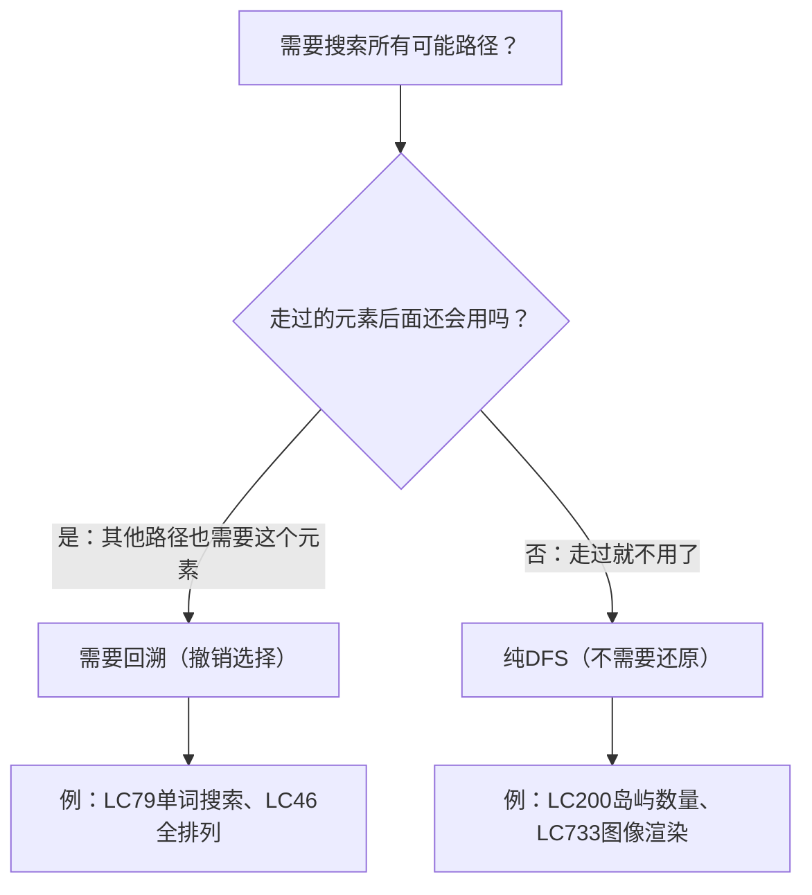

# DFS 与回溯详解
## 一、DFS 是什么？
**DFS（Depth-First Search，深度优先搜索）**：一条路走到黑，走不通了再退回来换一条路。
### 生活中的例子：走迷宫
```
你站在迷宫入口，面前有3条岔路：
1. 选第1条路，一直往前走
2. 走到死胡同了 → 退回到岔路口
3. 选第2条路，继续往前走
4. 又遇到岔路 → 选一条继续深入
5. 走到出口 → 成功！
核心：先深入到底，走不通再退回来
```
### 与 BFS 对比
```
DFS（深度优先）：先深入到底再回头   → 像一个人走迷宫
BFS（广度优先）：先把周围都看一遍   → 像水波一圈圈扩散
   DFS的顺序           BFS的顺序
      1                   1
     / \                 / \
    2   5               2   3
   / \   \             / \   \
  3   4   6           4   5   6
先走到底：1→2→3      一层一层：1→2,3→4,5,6
```
---
## 二、回溯是什么？
**回溯 = DFS + 撤销选择**。在 DFS 的基础上，走完一条路后**把走过的痕迹擦掉**，让其他路径也能走这条路。
### 生活中的例子：试衣服
```
你去商场试衣服：
1. 拿起第1件 → 穿上试试 → 不好看
2. 脱下来放回去（撤销选择）← 这就是回溯！
3. 拿起第2件 → 穿上试试 → 还不错
4. 再拿一条裤子搭配 → 不搭
5. 放回裤子（撤销）→ 换另一条裤子
如果不放回去（不回溯），后面就没衣服可试了
```
### DFS vs 回溯的区别
```
纯DFS：走过就走过了，不需要还原
  例：岛屿数量（LC200）→ 走过的格子标记为0，不需要还原
回溯：走过之后要还原，因为其他路径可能还需要这个格子
  例：单词搜索（LC79）→ 标记'*'后要还原回原字符
区别就一句话：需不需要"撤销选择"
```
---
## 三、回溯的三步模板
所有回溯问题都遵循同一个框架：
```java
void backtrack(路径, 选择列表) {
    // 终止条件
    if (满足结束条件) {
        收集结果;
        return;
    }
    for (选择 : 选择列表) {
        做选择;       // ① 选
        backtrack();  // ② 递归
        撤销选择;     // ③ 撤
    }
}
```
### 对应到单词搜索（LC79）
```java
boolean dfs(board, i, j, word, index) {
    // 终止条件
    if (越界 || 字符不匹配) return false;
    if (全部匹配完) return true;
    // ① 做选择：标记当前格子
    board[i][j] = '*';
    // ② 递归：向四个方向深入
    boolean found = dfs(上) || dfs(下) || dfs(左) || dfs(右);
    // ③ 撤销选择：还原当前格子
    board[i][j] = word.charAt(index);
    return found;
}
```
### 用图理解"选择→递归→撤销"
```
以 word = "ABC"，起点(0,0)='A' 为例：
                    (0,0)A
                  选择：标记*
                 /     |     \
              下(1,0)  右(0,1) ...
              B匹配✅   不匹配
            选择：标记*
           /    |    \
        下(2,0) 右(1,1) ...
        C匹配✅  不匹配
        找到了！返回true
每层递归做3件事：
  选 → 标记'*'
  递归 → 向四方向深入
  撤 → 还原字符（让其他路径能用）
```
---
## 四、为什么要回溯（撤销选择）？
```
board:        word = "ABA"
  A  B
  C  A
路径1：(0,0)A → (0,1)B → ???
  标记后：*  *
          C  A
  B的四周：上越界、下C≠A、左*≠A、右越界 → 失败
  如果不还原，board变成 * * / C A，后面全乱了
  ↓ 回溯还原 ↓
  还原后：A  B    ← board恢复原样
          C  A
路径2：(0,0)A → (0,1)B → (1,1)A → 匹配完成 ✅
  如果不回溯，(0,0)和(0,1)还是'*'，就找不到这条路了
```
> 回溯的本质：**我试过了不行，把现场恢复原样，让别人也能试**。
---
## 五、经典回溯问题分类
### 1. 网格搜索类
```
特点：在二维网格上DFS，上下左右四方向
标记：board[i][j] = '*' 或 visited[i][j] = true
还原：board[i][j] = 原字符 或 visited[i][j] = false
例题：LC79 单词搜索、LC212 单词搜索II
```
### 2. 排列组合类
```
特点：从候选集中选择元素，顺序/组合不同
标记：used[i] = true 或 从列表中移除
还原：used[i] = false 或 加回列表
例题：LC46 全排列、LC77 组合、LC78 子集
```
### 3. 棋盘类
```
特点：在棋盘上放置元素，满足约束条件
标记：board[row][col] = 'Q'
还原：board[row][col] = '.'
例题：LC51 N皇后、LC37 解数独
```
### 分类对比表
| 类型 | 选择 | 标记方式 | 还原方式 | 典型例题 |
|------|------|---------|---------|---------|
| 网格搜索 | 上下左右 | `board[i][j]='*'` | `board[i][j]=原值` | LC79 |
| 排列组合 | 选哪个元素 | `used[i]=true` | `used[i]=false` | LC46 |
| 棋盘放置 | 放哪个位置 | `board[r][c]='Q'` | `board[r][c]='.'` | LC51 |
---
## 六、DFS/回溯的代码模板
### 网格DFS模板（LC79 单词搜索）
```java
boolean dfs(char[][] board, int i, int j, String word, int index) {
    // 1. 终止条件：越界 或 不匹配
    if (i < 0 || i >= m || j < 0 || j >= n || board[i][j] != word.charAt(index)) {
        return false;
    }
    // 2. 成功条件
    if (index == word.length() - 1) return true;
    // 3. 做选择
    board[i][j] = '*';
    // 4. 递归四方向
    boolean res = dfs(board, i+1, j, word, index+1)
              || dfs(board, i-1, j, word, index+1)
              || dfs(board, i, j+1, word, index+1)
              || dfs(board, i, j-1, word, index+1);
    // 5. 撤销选择
    board[i][j] = word.charAt(index);
    return res;
}
```
### 排列回溯模板（LC46 全排列）
```java
void backtrack(int[] nums, List<Integer> path, boolean[] used, List<List<Integer>> res) {
    // 1. 终止条件
    if (path.size() == nums.length) {
        res.add(new ArrayList<>(path));
        return;
    }
    for (int i = 0; i < nums.length; i++) {
        if (used[i]) continue;  // 跳过已使用的
        // 2. 做选择
        path.add(nums[i]);
        used[i] = true;
        // 3. 递归
        backtrack(nums, path, used, res);
        // 4. 撤销选择
        path.remove(path.size() - 1);
        used[i] = false;
    }
}
```
---
## 七、一句话总结
```
DFS = 一条路走到黑，走不通就退回来
回溯 = DFS + 撤销选择（把现场恢复原样）
模板 = 做选择 → 递归 → 撤销选择
```
### 快速判断用不用回溯
