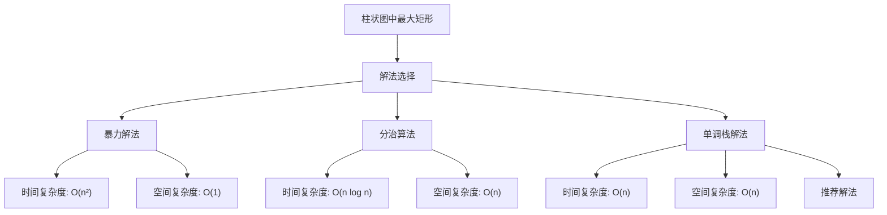

# LC84_柱状图中最大矩形解法分析
## 题目描述
给定 n 个非负整数，用来表示柱状图中各个柱子的高度。每个柱子彼此相邻，且宽度为 1。求在该柱状图中，能够勾勒出来的矩形的最大面积。
**示例：**
- 输入：heights = [2,1,5,6,2,3]
- 输出：10
- 解释：最大的矩形为图中红色区域，面积为 10
**提示：**
- 1 ≤ heights.length ≤ 10^5
- 0 ≤ heights[i] ≤ 10^4
## 解法概览

## 记忆口诀
**暴力解法**：双重循环找高度，遍历宽度算面积
**分治算法**：找最小值分左右，递归计算取最大
**单调栈**：单调递增栈，找左右边界，面积=高度×宽度
## 解法一：暴力解法
### 思路
对于每个柱子，以当前柱子的高度为矩形的高度，向左和向右扩展，找到左右两边第一个比当前高度小的柱子，计算以当前高度为高的最大矩形面积。
### 核心公式
对于每个 i (0 ≤ i < n)：
- 向左找到第一个 j，使得 heights[j] < heights[i]
- 向右找到第一个 k，使得 heights[k] < heights[i]
- 宽度 = k - j - 1
- 面积 = heights[i] × 宽度
- 最大面积 = max(最大面积, 面积)
### 图解过程
```
heights = [2,1,5,6,2,3]

i=0 (height=2):
- 左边界: -1
- 右边界: 1 (height=1 < 2)
- 宽度: 1-(-1)-1=1
- 面积: 2×1=2

i=1 (height=1):
- 左边界: -1
- 右边界: 6 (超出数组)
- 宽度: 6-(-1)-1=6
- 面积: 1×6=6

i=2 (height=5):
- 左边界: 1 (height=1 < 5)
- 右边界: 4 (height=2 < 5)
- 宽度: 4-1-1=2
- 面积: 5×2=10

i=3 (height=6):
- 左边界: 2 (height=5 < 6)
- 右边界: 4 (height=2 < 6)
- 宽度: 4-2-1=1
- 面积: 6×1=6

i=4 (height=2):
- 左边界: 1 (height=1 < 2)
- 右边界: 6 (超出数组)
- 宽度: 6-1-1=4
- 面积: 2×4=8

i=5 (height=3):
- 左边界: 4 (height=2 < 3)
- 右边界: 6 (超出数组)
- 宽度: 6-4-1=1
- 面积: 3×1=3

最大面积: 10
```
### 代码示例
```java
public int largestRectangleArea(int[] heights) {
    if (heights == null || heights.length == 0) {
        return 0;
    }
    int maxArea = 0;
    int n = heights.length;
    for (int i = 0; i < n; i++) {
        int left = i;
        while (left > 0 && heights[left - 1] >= heights[i]) {
            left--;
        }
        int right = i;
        while (right < n - 1 && heights[right + 1] >= heights[i]) {
            right++;
        }
        int width = right - left + 1;
        int area = heights[i] * width;
        maxArea = Math.max(maxArea, area);
    }
    return maxArea;
}
```
### 复杂度分析
- **时间复杂度**：O(n²)，其中 n 是柱状图的高度数组的长度。最坏情况下，每个柱子都需要向左和向右遍历所有柱子。
- **空间复杂度**：O(1)，只使用了常数级别的额外空间。
### 优缺点
- **优点**：实现简单，容易理解。
- **缺点**：时间复杂度较高，对于大规模输入（如题目提示中的 10^5 长度）会超时。
## 解法二：分治算法
### 思路
使用分治法，找到数组中的最小值，计算以该最小值为高的矩形面积，然后递归计算左右两部分的最大面积，取三者的最大值。
### 核心公式
- 找到数组中的最小值索引 minIndex
- 计算以 heights[minIndex] 为高，宽度为数组长度的面积
- 递归计算左半部分 [0, minIndex-1] 的最大面积
- 递归计算右半部分 [minIndex+1, n-1] 的最大面积
- 最大面积 = max(当前面积, 左半部分面积, 右半部分面积)
### 图解过程
```
heights = [2,1,5,6,2,3]

1. 找到最小值 1，索引为 1
2. 计算面积：1 × 6 = 6
3. 递归计算左半部分 [0,0] (height=2) → 面积 2
4. 递归计算右半部分 [2,5] [5,6,2,3]
   a. 找到最小值 2，索引为 3
   b. 计算面积：2 × 4 = 8
   c. 递归计算左半部分 [2,2] (height=5) → 面积 5
   d. 递归计算右半部分 [4,5] [2,3]
      i. 找到最小值 2，索引为 4
      ii. 计算面积：2 × 2 = 4
      iii. 递归计算左半部分 [] → 0
      iv. 递归计算右半部分 [5,5] (height=3) → 3
      v. 右半部分最大面积：max(4,0,3)=4
   e. 右半部分最大面积：max(8,5,4)=8
5. 最大面积：max(6,2,8)=8

实际最大面积是 10，这里因为分治的特性，可能不会直接找到全局最优解
```
### 代码示例
```java
public int largestRectangleArea(int[] heights) {
    if (heights == null || heights.length == 0) {
        return 0;
    }
    return calculateArea(heights, 0, heights.length - 1);
}

private int calculateArea(int[] heights, int start, int end) {
    if (start > end) {
        return 0;
    }
    int minIndex = start;
    for (int i = start; i <= end; i++) {
        if (heights[i] < heights[minIndex]) {
            minIndex = i;
        }
    }
    int currentArea = heights[minIndex] * (end - start + 1);
    int leftArea = calculateArea(heights, start, minIndex - 1);
    int rightArea = calculateArea(heights, minIndex + 1, end);
    return Math.max(currentArea, Math.max(leftArea, rightArea));
}
```
### 复杂度分析
- **时间复杂度**：O(n log n)，在平均情况下。最坏情况下（数组已排序），时间复杂度退化为 O(n²)。
- **空间复杂度**：O(n)，递归调用栈的深度。
### 优缺点
- **优点**：思路清晰，代码简洁。
- **缺点**：在最坏情况下时间复杂度仍为 O(n²)，对于大规模输入可能不够高效。
## 解法三：单调栈解法
### 思路
使用单调递增栈来维护柱子的索引，当遇到比栈顶元素小的柱子时，弹出栈顶元素并计算以该元素为高的矩形面积。通过栈可以快速找到每个柱子的左右边界（即第一个比它小的柱子）。
### 核心公式
- 栈中存储的是柱子的索引，对应高度单调递增
- 当遇到 height[i] ≤ height[栈顶] 时：
  - 弹出栈顶元素 j
  - 新的栈顶元素 k 是 j 左侧第一个比 j 小的柱子
  - i 是 j 右侧第一个比 j 小的柱子
  - 宽度 = i - k - 1
  - 面积 = height[j] × 宽度
- 遍历结束后，处理栈中剩余的元素
### 图解过程
```
heights = [2,1,5,6,2,3]
stack = [], maxArea = 0

i=0 (height=2):
- 栈空，压入0 → stack=[0]

i=1 (height=1):
- 1 < 2，弹出0
- 栈空，k=-1
- 宽度=1-(-1)-1=1
- 面积=2×1=2 → maxArea=2
- 压入1 → stack=[1]

i=2 (height=5):
- 5 > 1，压入2 → stack=[1,2]

i=3 (height=6):
- 6 > 5，压入3 → stack=[1,2,3]

i=4 (height=2):
- 2 < 6，弹出3
- 栈顶=2，k=2
- 宽度=4-2-1=1
- 面积=6×1=6 → maxArea=6
- 2 < 5，弹出2
- 栈顶=1，k=1
- 宽度=4-1-1=2
- 面积=5×2=10 → maxArea=10
- 2 > 1，压入4 → stack=[1,4]

i=5 (height=3):
- 3 > 2，压入5 → stack=[1,4,5]

遍历结束，处理栈中剩余元素：

i=6 (超出数组):
- 弹出5
- 栈顶=4，k=4
- 宽度=6-4-1=1
- 面积=3×1=3 → maxArea=10
- 弹出4
- 栈顶=1，k=1
- 宽度=6-1-1=4
- 面积=2×4=8 → maxArea=10
- 弹出1
- 栈空，k=-1
- 宽度=6-(-1)-1=6
- 面积=1×6=6 → maxArea=10

最终最大面积: 10
```
### 代码示例
```java
public int largestRectangleArea(int[] height) {
    if (height == null || height.length == 0) {
        return 0;
    }
    int maxArea = 0;
    Stack<Integer> stack = new Stack<>();
    for (int i = 0; i < height.length; i++) {
        while (!stack.isEmpty() && height[i] <= height[stack.peek()]) {
            int j = stack.pop();
            int k = stack.isEmpty() ? -1 : stack.peek();
            int curArea = (i - k - 1) * height[j];
            maxArea = Math.max(maxArea, curArea);
        }
        stack.push(i);
    }
    while (!stack.isEmpty()) {
        int j = stack.pop();
        int k = stack.isEmpty() ? -1 : stack.peek();
        int curArea = (height.length - k - 1) * height[j];
        maxArea = Math.max(maxArea, curArea);
    }
    return maxArea;
}
```
### 复杂度分析
- **时间复杂度**：O(n)，其中 n 是柱状图的高度数组的长度。每个元素最多入栈和出栈一次。
- **空间复杂度**：O(n)，最坏情况下，栈需要存储所有元素的索引。
### 优缺点
- **优点**：时间复杂度低，适用于大规模输入，是本题的最优解法。
- **缺点**：实现相对复杂，需要理解单调栈的工作原理。
## 面试回答模板
**问题**：请你解决 LC84_柱状图中最大矩形 问题。
**回答**：
这个问题是要在柱状图中找到最大的矩形面积。我可以提供三种解法：
首先，最直接的暴力解法是双重循环，对于每个柱子，向左和向右扩展找到边界，计算以当前高度为高的矩形面积。这种方法实现简单，但时间复杂度是 O(n²)，对于大规模输入会超时。
第二种方法是分治算法，找到数组中的最小值，计算以该值为高的矩形面积，然后递归处理左右两部分。这种方法的平均时间复杂度是 O(n log n)，但最坏情况下会退化为 O(n²)。
最推荐的是第三种方法，使用单调递增栈。我们维护一个单调递增栈，存储柱子的索引。当遇到比栈顶元素小的柱子时，弹出栈顶元素并计算以该元素为高的矩形面积。通过栈可以快速找到每个柱子的左右边界，时间复杂度是 O(n)，空间复杂度是 O(n)，适用于处理大规模输入。
我推荐使用单调栈解法，因为它在时间复杂度上最优，而且对于这种需要找到左右边界的问题，单调栈是一种常见且有效的方法。
## 相关题目
1. **LC85_最大矩形**：在二维矩阵中找到最大的矩形，可使用单调栈扩展 LC84 的思路。
2. **LC496_下一个更大元素 I**：寻找数组中每个元素的下一个更大元素。
3. **LC503_下一个更大元素 II**：循环数组中的下一个更大元素。
4. **LC739_每日温度**：寻找每个温度之后第一个更高温度的天数。
5. **LC901_股票价格跨度**：计算股票价格的跨度，类似寻找连续小于等于当前价格的天数。