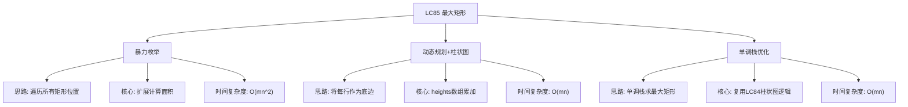

# 03-16-08-53 LC85_最大矩形解法分析
## 题目描述
给定一个仅包含 0 和 1 的二维二进制矩阵，找出只包含 1 的最大矩形面积。
**示例：**
输入：matrix = [["1","0","1","0","0"],["1","0","1","1","1"],["1","1","1","1","1"],["1","0","0","1","0"]]
输出：6
解释：最大矩形如上图所示，面积为6。
## 解法概览
### 思维导图

## 记忆口诀
**最大矩形：** 逐行转换柱状图，单调栈求最大；上到下累加高度，左右扩展找边界。
## 不同解法
### 解法一：暴力枚举（普通解法）
#### 思路
枚举所有可能的矩形左上角和右下角位置，然后计算该矩形中全是1的最大面积。
#### 核心公式
- 遍历所有左上角位置 (i, j)
- 遍历所有右下角位置 (k, l)
- 检查矩形是否全为1并更新最大面积
#### 图解过程
以 4x5 矩阵为例，枚举所有可能的矩形并检查：
- 1x1 矩形：4*5=20个
- 1x2 矩形：4*4=16个
- ...
- 4x5 矩形：1个
#### 代码示例
```java
public int maximalRectangle(char[][] matrix) {
    if (matrix == null || matrix.length == 0) {
        return 0;
    }
    int maxArea = 0;
    int m = matrix.length;
    int n = matrix[0].length;
    
    for (int i = 0; i < m; i++) {
        for (int j = 0; j < n; j++) {
            for (int k = i; k < m; k++) {
                for (int l = j; l < n; l++) {
                    if (isAllOne(matrix, i, j, k, l)) {
                        int area = (k - i + 1) * (l - j + 1);
                        maxArea = Math.max(maxArea, area);
                    }
                }
            }
        }
    }
    return maxArea;
}

private boolean isAllOne(char[][] matrix, int i, int j, int k, int l) {
    for (int x = i; x <= k; x++) {
        for (int y = j; y <= l; y++) {
            if (matrix[x][y] == '0') {
                return false;
            }
        }
    }
    return true;
}
```
#### 复杂度分析
- 时间复杂度：O(m*n*m*n)，其中m和n是矩阵的行数和列数
- 空间复杂度：O(1)
#### 优缺点
- 优点：思路简单，容易理解
- 缺点：时间复杂度太高，不适合大矩阵
### 解法二：动态规划+柱状图（最优解）
#### 思路
将二维矩阵转换为一维柱状图问题。对于每一行，将其上方的连续1的数量作为该列的高度，然后使用类似LC84柱状图中最大矩形的算法计算最大面积。
#### 核心公式
- heights[j] = matrix[i][j] == '1' ? heights[j] + 1 : 0
- 对于每一行，计算largestRectangleArea(heights)
- 返回所有行中的最大面积
#### 图解过程
以 matrix = [["1","0","1","0","0"],["1","0","1","1","1"],["1","1","1","1","1"],["1","0","0","1","0"]] 为例：
- 第0行：heights = [1,0,1,0,0]，最大面积 = 1
- 第1行：heights = [2,0,2,1,1]，最大面积 = 3
- 第2行：heights = [3,1,3,2,2]，最大面积 = 6
- 第3行：heights = [4,0,0,3,0]，最大面积 = 4
- 最终结果：6
#### 代码示例
```java
public int maximalRectangle(char[][] matrix) {
    if (matrix == null || matrix.length == 0) {
        return 0;
    }
    int[] heights = new int[matrix[0].length];
    int maxArea = 0;
    
    for (char[] row : matrix) {
        for (int j = 0; j < matrix[0].length; j++) {
            if (row[j] == '0') {
                heights[j] = 0;
            } else {
                heights[j]++;
            }
        }
        maxArea = Math.max(maxArea, largestRectangleArea(heights));
    }
    return maxArea;
}

private int largestRectangleArea(int[] heights) {
    if (heights == null || heights.length == 0) {
        return 0;
    }
    LinkedList<Integer> stack = new LinkedList<>();
    stack.push(-1);
    int maxArea = 0;
    
    for (int i = 0; i < heights.length; i++) {
        while (stack.peek() != -1 && heights[stack.peek()] >= heights[i]) {
            maxArea = Math.max(maxArea, heights[stack.pop()] * (i - 1 - stack.peek()));
        }
        stack.push(i);
    }
    
    while (stack.peek() != -1) {
        maxArea = Math.max(maxArea, heights[stack.pop()] * (heights.length - 1 - stack.peek()));
    }
    return maxArea;
}
```
#### 复杂度分析
- 时间复杂度：O(m*n)，遍历矩阵m次，每次计算柱状图最大矩形O(n)
- 空间复杂度：O(n)，存储高度数组
#### 优缺点
- 优点：时间复杂度最优，代码逻辑清晰
- 缺点：需要理解柱状图最大矩形算法
### 解法三：动态规划分别求左右边界（进阶）
#### 思路
使用动态规划分别计算每个位置向左和向右能扩展到的最远边界，以及向上能延伸的最大高度，然后计算最大矩形面积。
#### 核心公式
- left[j] = j == 0 ? (matrix[i][j] == '1' ? 1 : 0) : (matrix[i][j] == '1' ? left[j-1] + 1 : 0)
- right[j] = j == n-1 ? (matrix[i][j] == '1' ? 1 : n) : (matrix[i][j] == '1' ? right[j+1] : n)
- height[j] = matrix[i][j] == '1' ? height[j] + 1 : 0
- 面积 = min(left[j], right[j]) * height[j]
#### 代码示例
```java
public int maximalRectangle(char[][] matrix) {
    if (matrix == null || matrix.length == 0) {
        return 0;
    }
    int m = matrix.length;
    int n = matrix[0].length;
    int[] height = new int[n];
    int[] left = new int[n];
    int[] right = new int[n];
    int maxArea = 0;
    
    for (int i = 0; i < m; i++) {
        for (int j = 0; j < n; j++) {
            if (matrix[i][j] == '1') {
                height[j]++;
                left[j] = (j == 0) ? 1 : left[j - 1] + 1;
            } else {
                height[j] = 0;
                left[j] = 0;
            }
        }
        
        for (int j = n - 1; j >= 0; j--) {
            if (matrix[i][j] == '1') {
                right[j] = (j == n - 1) ? 1 : right[j + 1] + 1;
            } else {
                right[j] = n;
            }
        }
        
        for (int j = 0; j < n; j++) {
            int width = Math.min(left[j], right[j]);
            int area = width * height[j];
            maxArea = Math.max(maxArea, area);
        }
    }
    return maxArea;
}
```
#### 复杂度分析
- 时间复杂度：O(m*n)
- 空间复杂度：O(n)
#### 优缺点
- 优点：一次遍历完成计算，效率高
- 缺点：代码相对复杂
## 面试回答模板
**问题：** 请找出二进制矩阵中的最大矩形面积。
**回答：**
这是一道经典的算法题，主要使用动态规划和单调栈求解。
我主要使用将二维矩阵转换为一维柱状图的方法。具体思路是：
1. 对于每一行，将其上方的连续1的数量作为该列的高度，构建一个柱状图
2. 使用单调栈（类似LC84柱状图最大矩形）计算以该行为底边的最大矩形面积
3. 遍历所有行，取最大面积
这种方法的时间复杂度是 O(m*n)，空间复杂度是 O(n)，其中 m 和 n 分别是矩阵的行数和列数。
**示例：** 对于给定的 4x5 矩阵，最大矩形面积是 6。
## 相关题目
1. **LC84：柱状图中最大的矩形** - 最大矩形的基础，单调栈应用
2. **LC221：最大正方形** - 类似的最大面积问题
3. **LC662：二叉树的最大宽度** - 宽度计算类似
4. **LC04：有序矩阵中的第K小数** - 矩阵遍历技巧
这些题目都涉及到矩阵遍历和面积计算，与LC85_最大矩形有一定的关联性。