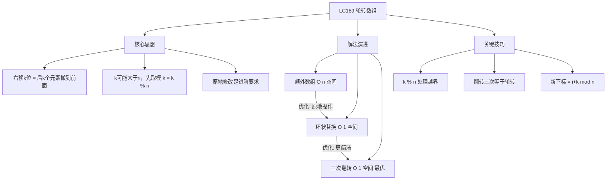
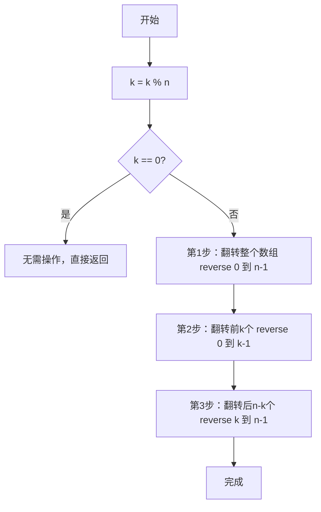

# LC189 轮转数组
## 一、题目描述
给定一个整数数组 `nums`，将数组中的元素向右轮转 `k` 个位置，其中 `k` 是非负数。要求**原地修改**数组。
**示例1：**
```
输入：nums = [1,2,3,4,5,6,7], k = 3
输出：[5,6,7,1,2,3,4]
解释：
向右轮转 1 步：[7,1,2,3,4,5,6]
向右轮转 2 步：[6,7,1,2,3,4,5]
向右轮转 3 步：[5,6,7,1,2,3,4]
```
**示例2：**
```
输入：nums = [-1,-100,3,99], k = 2
输出：[3,99,-1,-100]
```
**约束：**
- 1 <= nums.length <= 10^5
- k >= 0
- **进阶**：尽可能想出更多解法，至少有三种。能用 O(1) 的额外空间解决吗？
---
## 二、解法概览
### 解法对比表
| 解法 | 时间复杂度 | 空间复杂度 | 面试推荐 |
|------|-----------|-----------|---------|
| 额外数组 | O(n) | O(n) | ✅ 普通解法 |
| 环状替换 | O(n) | O(1) | ✅ 进阶解法 |
| **三次翻转** | O(n) | O(1) | ✅ **最优解** |
### 思维导图

---
## 三、记忆口诀
```
轮转数组三步翻，先把整体全翻转
前k个再翻一遍，后面剩的也翻转
k要先对n取模，三次reverse搞定它
```
---
## 四、解法一：额外数组
### 思路
创建一个新数组，将每个元素放到旋转后的正确位置，最后拷贝回原数组。元素 `nums[i]` 旋转后的新位置是 `(i + k) % n`。
### 核心公式
```
新位置 = (原位置 + k) % n
temp[(i + k) % n] = nums[i]
```
### `(i + k) % n` 怎么理解？
分两步理解：
- **`i + k`**：向右移动 k 步
- **`% n`**：到头了就绕回来（循环）
```
nums = [1, 2, 3, 4, 5, 6, 7],  n=7, k=3
直接 i + k：
  位置4的元素5，右移3步 → 4+3=7 → 超界了！下标最大是6
  位置5的元素6，右移3步 → 5+3=8 → 超界了！
加上 % n：
  元素5：(4+3) % 7 = 7 % 7 = 0  → 绕回到位置0
  元素6：(5+3) % 7 = 8 % 7 = 1  → 绕回到位置1
  元素7：(6+3) % 7 = 9 % 7 = 2  → 绕回到位置2
```
> 一句话：`i+k` 是"向右走k步"，`%n` 是"到头了就绕回来"。合起来就是**环形数组中右移k步的目标位置**。
### 图解过程
```
nums = [1, 2, 3, 4, 5, 6, 7], k = 3, n = 7
计算每个元素的新位置：
原下标i  元素  新下标(i+3)%7
  0       1      3
  1       2      4
  2       3      5
  3       4      6
  4       5      0  ← 绕回来了
  5       6      1  ← 绕回来了
  6       7      2  ← 绕回来了
temp数组填充过程：
temp[3]=1, temp[4]=2, temp[5]=3, temp[6]=4
temp[0]=5, temp[1]=6, temp[2]=7
temp = [5, 6, 7, 1, 2, 3, 4] ✅
拷贝回 nums
```
### 代码示例
```java
public void rotate(int[] nums, int k) {
    int n = nums.length;
    k = k % n; // 关键：k可能大于n
    if (k == 0) return;
    int[] temp = new int[n];
    for (int i = 0; i < n; i++) {
        temp[(i + k) % n] = nums[i];
    }
    // 拷贝回原数组
    System.arraycopy(temp, 0, nums, 0, n);
}
```
### 复杂度分析
- 时间复杂度：**O(n)**，遍历一次数组
- 空间复杂度：**O(n)**，额外数组
### 优缺点
| 优点 | 缺点 |
|-----|------|
| 思路直观、容易理解 | 需要O(n)额外空间 |
| 代码简洁 | 不满足进阶要求 |
---
## 五、解法二：环状替换
### 思路
从位置 0 开始，把元素放到它的目标位置 `(i+k)%n`，被挤走的元素继续放到它的目标位置，形成一个"环"。当回到起点时一个环结束，如果还有元素没处理，从下一个位置开始新的环。
**搬家比喻**：手里拿着位置0的人 → 放到位置3，同时把位置3的人拿起来 → 放到位置6 → 不断重复，直到回到位置0。
### 核心公式
```
下一个位置 = (当前位置 + k) % n
总共需要移动 n 次（每个元素恰好移动一次）
环的个数 = gcd(n, k)
```
### 图解过程
```
nums = [1, 2, 3, 4, 5, 6, 7], k = 3, n = 7
从 start=0 开始，手里拿着 carryValue=1
━━━━━━━━━━━━━━━━━━━━━━━━━━━━━━━━━━━━
第1次搬：手里拿着1，目标位置 (0+3)%7=3
  先取出 nums[3]=4 存好 → 把1放进去 → nums[3]=1
  手里现在拿着4
  nums = [1, 2, 3, 1, 5, 6, 7]
━━━━━━━━━━━━━━━━━━━━━━━━━━━━━━━━━━━━
第2次搬：手里拿着4，目标位置 (3+3)%7=6
  先取出 nums[6]=7 存好 → 把4放进去 → nums[6]=4
  手里现在拿着7
  nums = [1, 2, 3, 1, 5, 6, 4]
━━━━━━━━━━━━━━━━━━━━━━━━━━━━━━━━━━━━
第3次搬：手里拿着7，目标位置 (6+3)%7=2
  先取出 nums[2]=3 存好 → 把7放进去 → nums[2]=7
  手里现在拿着3
  nums = [1, 2, 7, 1, 5, 6, 4]
━━━━━━━━━━━━━━━━━━━━━━━━━━━━━━━━━━━━
第4次搬：手里拿着3，目标位置 (2+3)%7=5
  先取出 nums[5]=6 存好 → 把3放进去 → nums[5]=3
  手里现在拿着6
  nums = [1, 2, 7, 1, 5, 3, 4]
━━━━━━━━━━━━━━━━━━━━━━━━━━━━━━━━━━━━
第5次搬：手里拿着6，目标位置 (5+3)%7=1
  先取出 nums[1]=2 存好 → 把6放进去 → nums[1]=6
  手里现在拿着2
  nums = [1, 6, 7, 1, 5, 3, 4]
━━━━━━━━━━━━━━━━━━━━━━━━━━━━━━━━━━━━
第6次搬：手里拿着2，目标位置 (1+3)%7=4
  先取出 nums[4]=5 存好 → 把2放进去 → nums[4]=2
  手里现在拿着5
  nums = [1, 6, 7, 1, 2, 3, 4]
━━━━━━━━━━━━━━━━━━━━━━━━━━━━━━━━━━━━
第7次搬：手里拿着5，目标位置 (4+3)%7=0
  先取出 nums[0]=1 存好 → 把5放进去 → nums[0]=5
  手里现在拿着1
  nums = [5, 6, 7, 1, 2, 3, 4] ✅
━━━━━━━━━━━━━━━━━━━━━━━━━━━━━━━━━━━━
curIndex=0 == start=0，回到起点，环结束！
moved=7=n，全部归位，完成！
```
### 为什么可能有多个环？
当 n 和 k 有公因数时，一个环走不完所有元素：
```
nums = [1, 2, 3, 4, 5, 6], n=6, k=2
环1（start=0）：0 → 2 → 4 → 0  回到起点，只搬了3个
环2（start=1）：1 → 3 → 5 → 1  回到起点，又搬了3个
总共搬了6个 = n，完成！
```
> 规律：环的个数 = gcd(n, k)。当 n 和 k 互质时只有 1 个环。
### 代码示例
```java
public void rotate(int[] nums, int k) {
    int n = nums.length;
    k = k % n;
    if (k == 0) return;
    int moved = 0; // 已经归位的元素个数
    for (int start = 0; moved < n; start++) {
        int curIndex = start;
        int carryValue = nums[start];
        do {
            // 1. 算出目标位置
            int targetIndex = (curIndex + k) % n;
            // 2. 先把目标位置的值取出来
            int saved = nums[targetIndex];
            // 3. 把手里的值放到目标位置
            nums[targetIndex] = carryValue;
            // 4. 取出的值变成新的"手里的值"
            carryValue = saved;
            // 5. 移动到目标位置
            curIndex = targetIndex;
            moved++;
        } while (curIndex != start); // 下标回到起点，环结束
    }
}
```
### 为什么用 do-while？可以换成 while(true) 吗？
循环开始时 `curIndex == start` 天然成立，普通 while 一次都不会执行：
```java
// ❌ 一次都不执行
while (curIndex != start) { ... }
```
需要"先走一步再判断"，有两种等价写法：
**写法一：do-while（最简洁）**
```java
do {
    操作;
} while (curIndex != start);
```
**写法二：while(true) + break（推荐替代）**
```java
while (true) {
    操作;
    if (curIndex == start) break;
}
```
两者完全等价：`do { 操作 } while(条件)` ↔ `while(true) { 操作; if(!条件) break; }`
### 常见错误：终止条件写成 curValue != i
```java
// ❌ 错误：拿值和下标比较
} while (curValue != i);
// ✅ 正确：下标回到起点才停
} while (curIndex != i);
```
`curValue` 是数组的**值**，`i` 是起始**下标**，两个不是同一种东西：
```
第7次搬完后（应该停止的时刻）：
  curIndex = 0  ← 回到起点了，应该停！
  curValue = 1  ← 这是手里拿的值
错误条件：curValue(1) != i(0) → true → 继续循环 ❌ 死循环
正确条件：curIndex(0) != i(0) → false → 停止 ✅
```
> 记住：**环是在下标上走的，回到起始下标就说明环走完了**。跟值没关系。
### 复杂度分析
- 时间复杂度：**O(n)**，每个元素只移动一次
- 空间复杂度：**O(1)**，只用了几个临时变量
### 优缺点
| 优点 | 缺点 |
|-----|------|
| 空间O(1)，满足进阶要求 | 理解成本高 |
| 每个元素只移动一次 | 环的终止条件容易写错 |
---
## 六、解法三：三次翻转（最优解 ✅）
### 思路
右移 k 位的本质是：把数组**后 k 个元素**搬到**前面**。通过三次翻转可以巧妙实现：
1. **整体翻转**：把整个数组反转
2. **翻转前 k 个**：把前 k 个元素反转
3. **翻转后 n-k 个**：把剩余元素反转
### 核心公式
```
原数组:     [1, 2, 3, 4 | 5, 6, 7]    前n-k个 | 后k个
第一步整体翻转: [7, 6, 5, 4, 3, 2, 1]
第二步翻转前k:  [5, 6, 7 | 4, 3, 2, 1]
第三步翻转后n-k:[5, 6, 7 | 1, 2, 3, 4]  ✅
```
### 为什么三次翻转能实现轮转？
```
原数组分为两段：A = [1,2,3,4]  B = [5,6,7]
目标：BA = [5,6,7,1,2,3,4]
第1步 整体翻转 (AB)^T = B^T A^T = [7,6,5][4,3,2,1]
第2步 翻转前k (B^T)^T = B = [5,6,7]
第3步 翻转后n-k (A^T)^T = A = [1,2,3,4]
最终：BA = [5,6,7,1,2,3,4] ✅
数学证明：(AB)^T 整体翻转后前k个就是B^T，再翻转就是B
```
### 图解过程
```
nums = [1, 2, 3, 4, 5, 6, 7], k = 3
━━━━━━━━━━━━━━━━━━━━━━━━━━━━━━━━━━
第0步：k = k % n = 3 % 7 = 3
━━━━━━━━━━━━━━━━━━━━━━━━━━━━━━━━━━
第1步：整体翻转 reverse(0, 6)
  [1, 2, 3, 4, 5, 6, 7]
   ↕                 ↕
  [7, 2, 3, 4, 5, 6, 1]
      ↕           ↕
  [7, 6, 3, 4, 5, 2, 1]
         ↕     ↕
  [7, 6, 5, 4, 3, 2, 1]
结果：[7, 6, 5, 4, 3, 2, 1]
━━━━━━━━━━━━━━━━━━━━━━━━━━━━━━━━━━
第2步：翻转前k=3个 reverse(0, 2)
  [7, 6, 5 | 4, 3, 2, 1]
   ↕     ↕
  [5, 6, 7 | 4, 3, 2, 1]
结果：[5, 6, 7, 4, 3, 2, 1]
━━━━━━━━━━━━━━━━━━━━━━━━━━━━━━━━━━
第3步：翻转后n-k=4个 reverse(3, 6)
  [5, 6, 7 | 4, 3, 2, 1]
              ↕        ↕
  [5, 6, 7 | 1, 3, 2, 4]
                 ↕  ↕
  [5, 6, 7 | 1, 2, 3, 4]
结果：[5, 6, 7, 1, 2, 3, 4] ✅
```
### 算法流程图

### 代码示例
```java
public void rotate(int[] nums, int k) {
    int n = nums.length;
    k = k % n; // 关键：处理k >= n的情况
    if (k == 0) return;
    // 三次翻转
    reverse(nums, 0, n - 1);     // 整体翻转
    reverse(nums, 0, k - 1);     // 翻转前k个
    reverse(nums, k, n - 1);     // 翻转后n-k个
}
private void reverse(int[] nums, int left, int right) {
    while (left < right) {
        int temp = nums[left];
        nums[left] = nums[right];
        nums[right] = temp;
        left++;
        right--;
    }
}
```
### 复杂度分析
- 时间复杂度：**O(n)**，三次翻转，每次 O(n)，总共 O(3n) = O(n)
- 空间复杂度：**O(1)**，只用了一个 temp 变量
### 优缺点
| 优点 | 缺点 |
|-----|------|
| 时间O(n)，空间O(1) | 需要理解三次翻转的原理 |
| 代码简洁优雅 | 不够直观 |
| 面试首选 | 无 |
### 关键点总结
| 关键点 | 说明 |
|-------|------|
| 为什么先 k%n？ | k=10,n=7 轮转10次等于轮转3次 |
| 为什么三次翻转有效？ | (AB)^T 的前k个是B^T，再翻转回B |
| reverse 函数 | 双指针交换，左右向中间靠拢 |
| k=0 的特判 | k是n的倍数时不需要操作 |
---
## 七、面试回答模板
### 1. 开场：理解题意
> 这道题要求将数组向右轮转 k 位，本质上是把后 k 个元素搬到数组前面。
### 2. 思路：三次翻转
> 我用三次翻转法来解决。先整体翻转数组，然后翻转前 k 个元素，最后翻转剩下的 n-k 个元素。
### 3. 举例说明
> 比如 [1,2,3,4,5,6,7]，k=3。整体翻转得到 [7,6,5,4,3,2,1]，翻转前3个得到 [5,6,7,4,3,2,1]，翻转后4个得到 [5,6,7,1,2,3,4]。
### 4. 关键细节（如果面试官问）
> 需要注意 k 可能大于数组长度，所以先做 k = k % n。另外 k=0 时可以直接返回。
### 5. 复杂度
> 时间复杂度 O(n)，三次翻转每次线性。空间复杂度 O(1)，只用了一个临时变量做交换。
---
## 八、相关题目
| 题号 | 题目 | 关系 | 难度 |
|-----|------|------|-----|
| LC61 | 旋转链表 | 链表版轮转 | 中等 |
| LC186 | 反转字符串中的单词II | 同样三次翻转思想 | 中等 |
| LC344 | 反转字符串 | reverse 基础操作 | 简单 |
| LC151 | 反转字符串中的单词 | 三次翻转变体 | 中等 |
| LC796 | 旋转字符串 | 字符串轮转判断 | 简单 |
