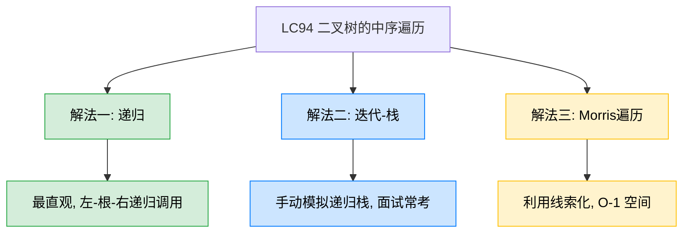
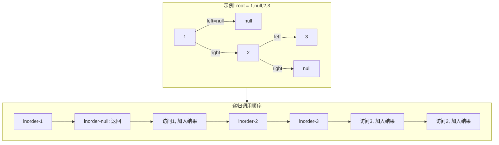
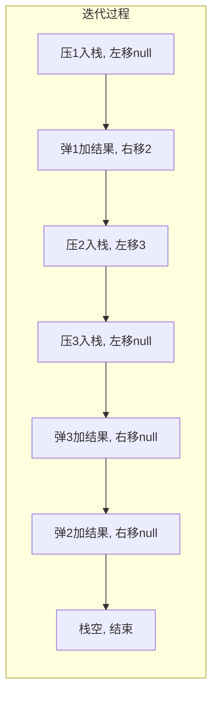
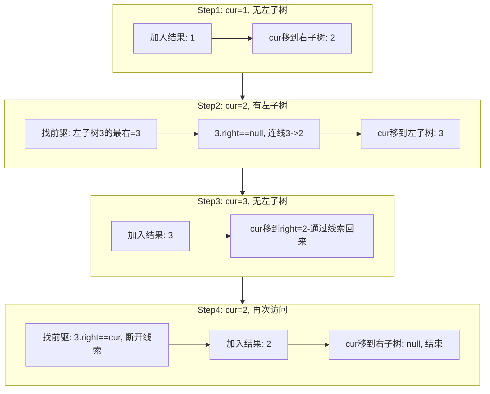

# LC94 二叉树的中序遍历
## 一、题目描述
给定一个二叉树的根节点 root，返回它的**中序遍历**结果。
中序遍历顺序：**左子树 → 根节点 → 右子树**。
**示例：** 输入 `root = [1,null,2,3]`，输出 `[1,3,2]`
**约束：** 树中节点数目在范围 [0, 100] 内，-100 <= Node.val <= 100
## 二、解法概览

| 解法 | 时间复杂度 | 空间复杂度 | 难度 | 面试推荐 |
|------|-----------|-----------|------|---------|
| 递归 | O(n) | O(n) | ⭐ | 入门必会 |
| 迭代-栈 | O(n) | O(n) | ⭐⭐ | 面试首选 |
| Morris遍历 | O(n) | O(1) | ⭐⭐⭐ | 最优解/进阶加分 |
## 三、记忆口诀
> **递归三行最简单，迭代左压弹右转，Morris线索借右连。**
- 递归：「**左递归、加自己、右递归**」
- 迭代：「**左压到底、弹出加结果、转向右子树**」
- Morris：「**无左直走、有左找前驱、右空连回来、右有断回去**」
## 四、解法一：递归
### 4.1 思路
中序遍历的定义本身就是递归的：先递归遍历左子树，再访问根节点，最后递归遍历右子树。
### 4.2 核心公式
`inorder(node) = inorder(node.left) + node.val + inorder(node.right)`
### 4.3 图解过程

结果：`[1, 3, 2]`
### 4.4 代码示例
```java
public List<Integer> inorderTraversal(TreeNode root) {
    List<Integer> res = new ArrayList<>();
    inorder(root, res);
    return res;
}
private void inorder(TreeNode node, List<Integer> res) {
    if (node == null) return;
    inorder(node.left, res);
    res.add(node.val);
    inorder(node.right, res);
}
```
### 4.5 复杂度分析
- **时间复杂度：O(n)**，每个节点访问一次
- **空间复杂度：O(n)**，递归栈深度，最坏为链状树时 O(n)，平衡时 O(log n)
### 4.6 优缺点
| 优点 | 缺点 |
|------|------|
| 代码最短，三行核心逻辑 | 递归栈深度大时可能栈溢出 |
| 和定义完全一致，易理解 | 面试官可能要求非递归实现 |
## 五、解法二：迭代-栈（面试首选）
### 5.1 思路
用显式栈模拟递归过程。核心思路：不断将左子节点压栈，直到左子树为空；然后弹出栈顶节点加入结果，再转向右子树，重复该过程。
### 5.2 核心公式
循环不变量：`while (栈不空 || 当前节点不空)`
- 当前节点不空 → 压栈，走左子树
- 当前节点空 → 弹栈，加结果，走右子树
### 5.3 图解过程
以 `[1, null, 2, 3]` 为例：
| 步骤 | 当前节点 | 操作 | 栈状态 | 结果 |
|------|---------|------|--------|------|
| 1 | 1 | 压栈，左移 | [1] | [] |
| 2 | null | 弹出1，加结果，右移到2 | [] | [1] |
| 3 | 2 | 压栈，左移 | [2] | [1] |
| 4 | 3 | 压栈，左移 | [2,3] | [1] |
| 5 | null | 弹出3，加结果，右移null | [2] | [1,3] |
| 6 | null | 弹出2，加结果，右移null | [] | [1,3,2] |
| 7 | null | 栈空且节点空，结束 | [] | [1,3,2] |

### 5.4 代码示例
```java
public List<Integer> inorderTraversal(TreeNode root) {
    LinkedList<TreeNode> stack = new LinkedList<>();
    List<Integer> res = new LinkedList<>();
    while (!stack.isEmpty() || root != null) {
        if (root != null) {
            stack.push(root);
            root = root.left;
        } else {
            root = stack.pop();
            res.add(root.val);
            root = root.right;
        }
    }
    return res;
}
```
### 5.5 复杂度分析
- **时间复杂度：O(n)**，每个节点入栈出栈各一次
- **空间复杂度：O(n)**，栈最多存储 O(n) 个节点（链状树）
### 5.6 优缺点
| 优点 | 缺点 |
|------|------|
| 不依赖递归，无栈溢出风险 | 代码比递归长 |
| 面试高频考点，展示栈的理解 | 空间仍然是 O(n) |
| 逻辑清晰：左压到底、弹出加结果、转右 | 初学者需要画图辅助理解 |
## 六、解法三：Morris遍历（最优解）
### 6.1 思路
利用**线索二叉树**的思想：找到当前节点的中序前驱节点（左子树的最右节点），将前驱的 right 指回当前节点，从而不需要栈就能回溯。遍历完成后恢复树结构。
### 6.2 核心公式
对于当前节点 cur：
- **无左子树：** 加入结果，cur = cur.right
- **有左子树：** 找到左子树的最右节点 mostRight
  - mostRight.right == null → 连线回 cur，cur = cur.left
  - mostRight.right == cur → 断开连线，加入结果，cur = cur.right
### 6.3 图解过程

### 6.4 代码示例
```java
public List<Integer> inorderTraversal(TreeNode root) {
    List<Integer> res = new ArrayList<>();
    TreeNode cur = root;
    TreeNode mostRight;
    while (cur != null) {
        if (cur.left == null) {
            res.add(cur.val);
            cur = cur.right;
        } else {
            mostRight = cur.left;
            while (mostRight.right != null && mostRight.right != cur) {
                mostRight = mostRight.right;
            }
            if (mostRight.right == null) {
                mostRight.right = cur;
                cur = cur.left;
            } else {
                mostRight.right = null;
                res.add(cur.val);
                cur = cur.right;
            }
        }
    }
    return res;
}
```
### 6.5 复杂度分析
- **时间复杂度：O(n)**，每个节点最多被访问两次（建线索和断线索），每条边最多走两次
- **空间复杂度：O(1)**，不使用栈和递归，只用几个指针变量
### 6.6 优缺点
| 优点 | 缺点 |
|------|------|
| 空间最优 O(1) | 代码较复杂，不容易记 |
| 不修改最终树结构（遍历后恢复） | 临时修改了树的指针 |
| 面试进阶加分项 | 面试中一般不强制要求 |
## 七、面试回答模板
> **面试官：** 实现二叉树的中序遍历。
**回答要点：**
1. **先说定义：** 中序遍历的顺序是左-根-右。递归写法三行代码就能搞定，但面试一般要求非递归实现。
2. **给出迭代解法：** 用栈模拟递归。核心逻辑是：把左子节点一路压栈压到底，然后弹出栈顶加入结果，再转向右子树重复这个过程。循环条件是「栈不空或当前节点不空」。
3. **分析复杂度：** 时间 O(n)，空间 O(n)。
4. **延伸：** 如果面试官追问 O(1) 空间的做法，可以介绍 Morris 遍历，利用线索二叉树的思想，找前驱建临时连线，遍历后恢复。时间仍是 O(n)，空间降到 O(1)。
5. **对比三种序：** 前序、中序、后序的迭代写法区别在于「加入结果的时机」不同：前序在压栈时加，中序在弹栈时加，后序需要额外标记或反转。
## 八、相关题目
| 题目 | 关联点 |
|------|--------|
| LC144 二叉树的前序遍历 | 迭代写法类似，加结果的时机不同 |
| LC145 二叉树的后序遍历 | 迭代写法最复杂，需要额外技巧 |
| LC230 二叉搜索树中第K小的元素 | 中序遍历BST得到有序序列 |
| LC98 验证二叉搜索树 | 中序遍历判断是否严格递增 |
| LC173 二叉搜索树迭代器 | 本质就是中序遍历的迭代版拆分成next调用 |
| LC99 恢复二叉搜索树 | Morris遍历的经典应用场景 |
