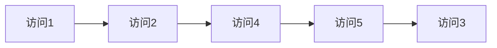
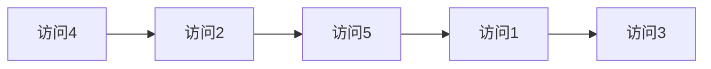
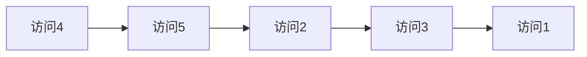
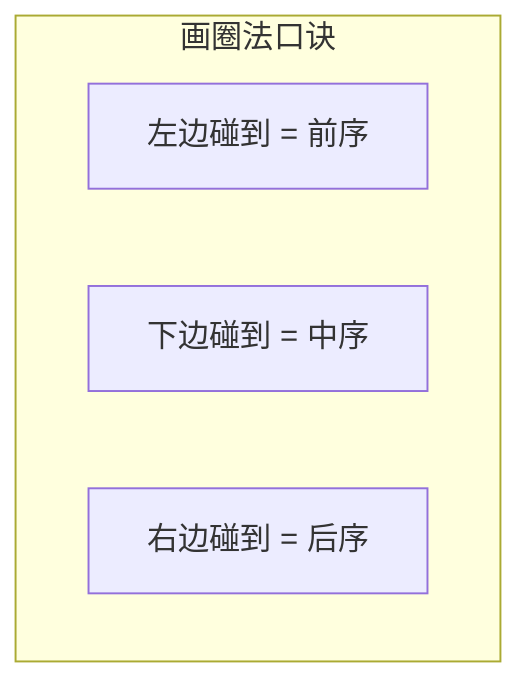

# 二叉树前序、中序、后序遍历速记指南
## 一、一句话区分
三种遍历的区别只在于**根节点什么时候访问**：
| 遍历 | 顺序 | 记忆 |
|------|------|------|
| 前序 | **根** → 左 → 右 | 根在**前**面 |
| 中序 | 左 → **根** → 右 | 根在**中**间 |
| 后序 | 左 → 右 → **根** | 根在**后**面 |
## 二、统一示例
用这棵树贯穿全文：
```
        1
       / \
      2   3
     / \
    4   5
```
## 三、三种遍历结果
### 3.1 前序遍历（根-左-右）：1, 2, 4, 5, 3
```
访问1(根) → 进左子树 → 访问2(根) → 进左子树 → 访问4(叶)
→ 回来 → 访问5(叶) → 回来 → 进右子树 → 访问3(叶)
```

### 3.2 中序遍历（左-根-右）：4, 2, 5, 1, 3
```
先走到最左 → 访问4 → 回到2 → 访问2 → 进右 → 访问5
→ 回到1 → 访问1 → 进右 → 访问3
```

### 3.3 后序遍历（左-右-根）：4, 5, 2, 3, 1
```
先走到最左 → 访问4 → 走到5 → 访问5 → 左右都完了 → 访问2
→ 走到3 → 访问3 → 左右都完了 → 访问1
```

## 四、最直觉的记法：画圈法
在树的外围画一圈，每个节点标三个触碰点：**左边、下面、右边**。
```
        ·1·
        ·
       / \
      ·2·  ·3·
      ·     ·
     / \
    ·4· ·5·
    ·   ·
```
沿外围**逆时针走一圈**，按不同触碰位置记录：
| 触碰位置 | 对应遍历 | 记录结果 |
|---------|---------|---------|
| 经过节点**左边**时记录 | 前序 | 1, 2, 4, 5, 3 |
| 经过节点**下边**时记录 | 中序 | 4, 2, 5, 1, 3 |
| 经过节点**右边**时记录 | 后序 | 4, 5, 2, 3, 1 |

## 五、快速验证技巧
拿到一个遍历结果，可以用以下规律快速验证：
| 规律 | 说明 |
|------|------|
| 前序的**第一个**一定是根节点 | 前序: **1**, 2, 4, 5, 3 |
| 后序的**最后一个**一定是根节点 | 后序: 4, 5, 2, 3, **1** |
| 中序中根节点把序列**分成左右两半** | 中序: 4,2,5 **|1|** 3 → 左子树3个节点, 右子树1个节点 |
## 六、递归代码对比
三种遍历的递归代码只有**一行位置不同**：`res.add(node.val)` 放在哪里。
```java
// 前序：根-左-右
void preorder(TreeNode node, List<Integer> res) {
    if (node == null) return;
    res.add(node.val);       // ← 先加根
    preorder(node.left, res);
    preorder(node.right, res);
}
// 中序：左-根-右
void inorder(TreeNode node, List<Integer> res) {
    if (node == null) return;
    inorder(node.left, res);
    res.add(node.val);       // ← 中间加根
    inorder(node.right, res);
}
// 后序：左-右-根
void postorder(TreeNode node, List<Integer> res) {
    if (node == null) return;
    postorder(node.left, res);
    postorder(node.right, res);
    res.add(node.val);       // ← 最后加根
}
```
## 七、迭代写法对比
| 遍历 | 迭代核心思路 | 加入结果的时机 |
|------|------------|--------------|
| 前序 | 压栈时先右后左 | **压栈前**加入结果 |
| 中序 | 左子树压到底 | **弹栈时**加入结果 |
| 后序 | 按"根-右-左"遍历再反转 | 最后**反转**结果 |
## 八、总结速记卡
```
前序 = 根左右 = 第一个是根 = 递归中add放最前
中序 = 左根右 = 根分两半   = 递归中add放中间
后序 = 左右根 = 最后一个是根 = 递归中add放最后
画圈法：逆时针绕一圈，左碰前序、下碰中序、右碰后序
```
