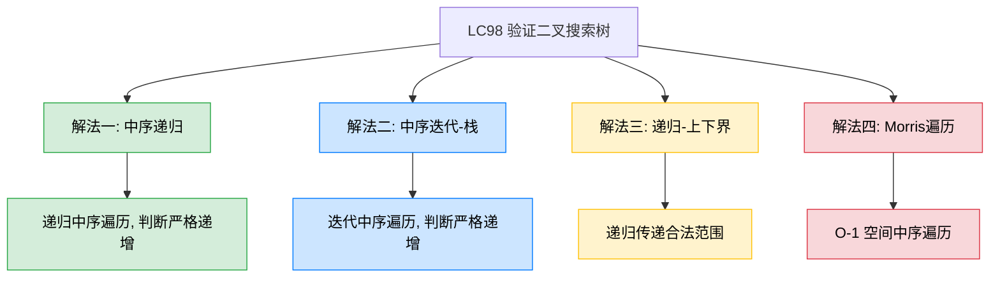
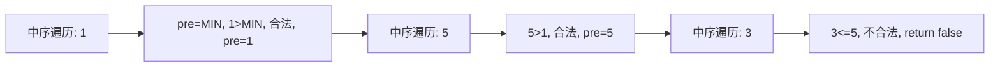
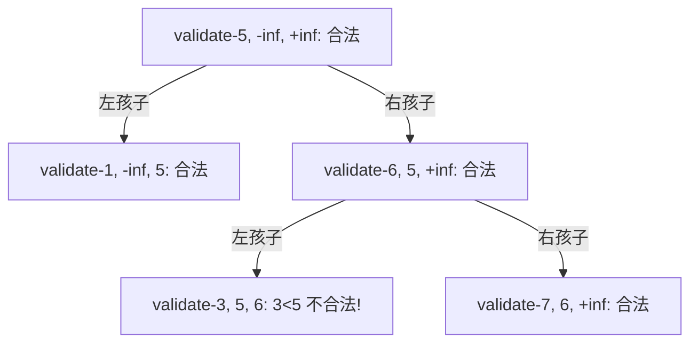

# LC98 验证二叉搜索树
## 一、题目描述
给你一个二叉树的根节点 root，判断其是否是一个有效的**二叉搜索树（BST）**。
BST 的定义：左子树所有节点的值**严格小于**根节点的值；右子树所有节点的值**严格大于**根节点的值；左右子树也分别为BST。
**示例1：** 输入 `root = [2,1,3]`，输出 `true`
**示例2：** 输入 `root = [5,1,4,null,null,3,6]`，输出 `false`（4 < 5，不应出现在右子树）
**约束：** 树中节点数目在范围 [1, 10^4] 内，-2^31 <= Node.val <= 2^31 - 1
## 二、解法概览

| 解法 | 时间复杂度 | 空间复杂度 | 难度 | 面试推荐 |
|------|-----------|-----------|------|---------|
| 中序递归 | O(n) | O(n) | ⭐⭐ | 面试首选 |
| 中序迭代-栈 | O(n) | O(n) | ⭐⭐ | 面试常用 |
| 递归-上下界 | O(n) | O(n) | ⭐⭐ | 另一种思路 |
| Morris遍历 | O(n) | O(1) | ⭐⭐⭐ | 最优解/进阶加分 |
## 三、记忆口诀
> **BST中序必递增，前一个比后一个小，违反就不是BST。**
核心性质：BST 的中序遍历结果是**严格递增**序列。所以验证 BST = 验证中序遍历是否严格递增。
## 四、常见陷阱
**错误做法：** 只判断 `左孩子 < 根 < 右孩子`。
```
      5
     / \
    1   6
       / \
      3   7     ← 3 < 5，不应出现在5的右子树中
```
节点3虽然满足 `3 < 6`（和直接父节点比较），但不满足 `3 > 5`（和祖先节点比较）。所以必须确保**左子树所有节点** < 根 < **右子树所有节点**，而不只是直接孩子。
## 五、解法一：中序递归（面试首选）
### 5.1 思路
利用 BST 中序遍历严格递增的性质。用一个 `pre` 变量记录中序遍历中上一个节点的值，如果当前值 <= pre，说明不是 BST。
### 5.2 核心公式
中序遍历过程中：`当前值 > pre` 则合法，更新 `pre = 当前值`；否则返回 false。
### 5.3 图解过程
以 `[5, 1, 6, null, null, 3, 7]` 为例：

### 5.4 代码示例
```java
private long pre = Long.MIN_VALUE;
public boolean isValidBST(TreeNode root) {
    if (root == null) return true;
    // 左子树是否是BST
    if (!isValidBST(root.left)) return false;
    // 中序：当前值必须严格大于前一个值
    if (root.val <= pre) return false;
    pre = root.val;
    // 右子树是否是BST
    return isValidBST(root.right);
}
```
### 5.5 为什么 pre 用 long？
题目约束 Node.val 的范围是 `[-2^31, 2^31-1]`，如果某个节点的值恰好是 `Integer.MIN_VALUE`（即 -2^31），而 pre 初始化为 `Integer.MIN_VALUE`，第一个比较 `root.val <= pre` 就会误判为 false。用 `Long.MIN_VALUE` 可以避免这个边界问题。
### 5.6 复杂度分析
- **时间复杂度：O(n)**，最坏遍历所有节点
- **空间复杂度：O(n)**，递归栈深度，最坏链状树 O(n)
### 5.7 优缺点
| 优点 | 缺点 |
|------|------|
| 代码最简洁，利用BST核心性质 | 使用了成员变量 pre，不够纯粹 |
| 面试首选，容易讲清楚 | 递归深度大时可能栈溢出 |
## 六、解法二：中序迭代-栈
### 6.1 思路
和解法一完全相同的思路，只是用迭代+栈代替递归做中序遍历。在弹出节点时判断是否严格递增。
### 6.2 代码示例
```java
public boolean isValidBST(TreeNode root) {
    Deque<TreeNode> stack = new ArrayDeque<>();
    long pre = Long.MIN_VALUE;
    while (!stack.isEmpty() || root != null) {
        if (root != null) {
            stack.push(root);
            root = root.left;
        } else {
            root = stack.pop();
            if (root.val <= pre) return false;
            pre = root.val;
            root = root.right;
        }
    }
    return true;
}
```
### 6.3 复杂度分析
- **时间复杂度：O(n)**
- **空间复杂度：O(n)**，栈空间
### 6.4 优缺点
| 优点 | 缺点 |
|------|------|
| 无栈溢出风险 | 代码比递归稍长 |
| pre 是局部变量，更干净 | 需要理解中序迭代模板 |
| 可以提前终止，不用遍历完 | 空间仍是 O(n) |
## 七、解法三：递归-上下界
### 7.1 思路
另一种递归思路：给每个节点传递一个合法的值范围 `(lower, upper)`。根节点范围是 `(-inf, +inf)`，左孩子范围变为 `(lower, 根的值)`，右孩子范围变为 `(根的值, upper)`。如果节点值不在范围内就返回 false。
### 7.2 核心公式
`validate(node, lower, upper)`：node.val 必须满足 `lower < node.val < upper`。
### 7.3 图解过程

节点3的范围是 (5, 6)，但 3 < 5，不在范围内，返回 false。
### 7.4 代码示例
```java
public boolean isValidBST(TreeNode root) {
    return validate(root, Long.MIN_VALUE, Long.MAX_VALUE);
}
private boolean validate(TreeNode node, long lower, long upper) {
    if (node == null) return true;
    if (node.val <= lower || node.val >= upper) return false;
    return validate(node.left, lower, node.val)
        && validate(node.right, node.val, upper);
}
```
### 7.5 复杂度分析
- **时间复杂度：O(n)**
- **空间复杂度：O(n)**，递归栈
### 7.6 优缺点
| 优点 | 缺点 |
|------|------|
| 不依赖中序遍历，思路独立 | 需要理解上下界的传递 |
| 没有全局变量 | 面试时需解释清楚范围缩小逻辑 |
| 直接验证BST定义 | 和中序法本质等价 |
## 八、解法四：Morris遍历（最优解）
### 8.1 思路
用 Morris 中序遍历实现 O(1) 空间。在每次访问节点时（无左子树直接访问，有左子树第二次到达时访问），判断是否严格递增。
### 8.2 代码示例
```java
public boolean isValidBST(TreeNode root) {
    TreeNode cur = root;
    TreeNode mostRight;
    long preValue = Long.MIN_VALUE;
    while (cur != null) {
        mostRight = cur.left;
        if (mostRight != null) {
            while (mostRight.right != null && mostRight.right != cur) {
                mostRight = mostRight.right;
            }
            if (mostRight.right == null) {
                mostRight.right = cur;
                cur = cur.left;
                continue;
            } else {
                mostRight.right = null;
            }
        }
        if (cur.val <= preValue) return false;
        preValue = cur.val;
        cur = cur.right;
    }
    return true;
}
```
### 8.3 复杂度分析
- **时间复杂度：O(n)**
- **空间复杂度：O(1)**，不使用栈和递归
### 8.4 优缺点
| 优点 | 缺点 |
|------|------|
| 空间最优 O(1) | 代码复杂，面试中一般不要求 |
| 遍历后恢复树结构 | 需要掌握 Morris 遍历模板 |
## 九、四种解法对比
| 对比项 | 中序递归 | 中序迭代 | 上下界递归 | Morris |
|--------|---------|---------|----------|--------|
| 核心思想 | 中序严格递增 | 中序严格递增 | 范围逐层缩小 | 中序严格递增 |
| 空间 | O(n) | O(n) | O(n) | O(1) |
| 代码量 | 最少 | 中等 | 中等 | 最多 |
| 面试推荐 | 首选 | 常用 | 备选 | 加分 |
## 十、面试回答模板
> **面试官：** 判断一棵二叉树是否是有效的BST。
**回答要点：**
1. **说性质：** BST 的核心性质是中序遍历结果严格递增。所以验证 BST 就等于验证中序遍历是否严格递增。
2. **说陷阱：** 不能只判断"左孩子 < 根 < 右孩子"，必须保证左子树**所有**节点 < 根 < 右子树**所有**节点。比如 [5,1,6,null,null,3,7] 中节点3虽然 < 6，但 < 5，不应出现在5的右子树。
3. **写代码：** 用中序递归，维护一个 pre 变量记录前一个值。每次比较 `root.val > pre`，不满足就返回 false。pre 初始化用 `Long.MIN_VALUE` 避免 int 边界问题。
4. **复杂度：** 时间 O(n)，空间 O(n)。
5. **延伸：** 还可以用上下界法（给每个节点传递合法范围），或者 Morris 遍历实现 O(1) 空间。
## 十一、相关题目
| 题目 | 关联点 |
|------|--------|
| LC94 二叉树的中序遍历 | 本题的基础，先会中序遍历 |
| LC230 二叉搜索树中第K小的元素 | 同样利用中序遍历递增的性质 |
| LC108 将有序数组转换为BST | BST构建，本题的逆过程 |
| LC99 恢复二叉搜索树 | BST中两个节点被交换，找到并恢复 |
| LC700 二叉搜索树中的搜索 | BST的基本操作 |
| LC450 删除二叉搜索树中的节点 | BST的删除操作 |
