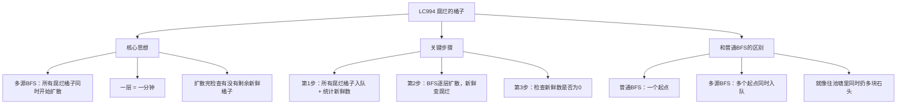
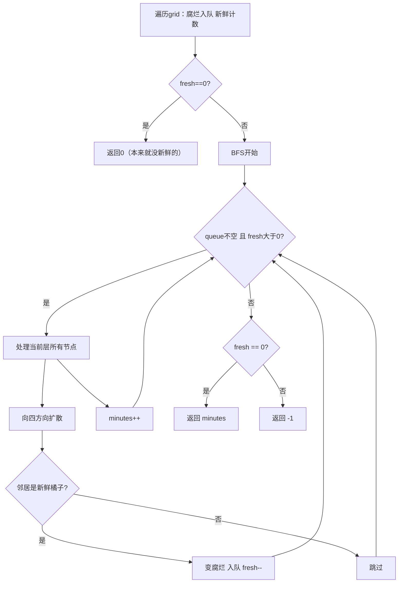

# LC994 腐烂的橘子
## 一、题目描述
在给定的 `m x n` 网格 `grid` 中，每个单元格可以有以下三个值之一：
- `0` 表示空单元格
- `1` 表示新鲜橘子
- `2` 表示腐烂的橘子
每分钟，腐烂的橘子会向**四个方向**（上下左右）传染相邻的新鲜橘子。返回直到所有橘子都腐烂的**最少分钟数**。如果不可能全部腐烂，返回 `-1`。
**示例1：**
```
输入：grid = [[2,1,1],
              [1,1,0],
              [0,1,1]]
输出：4
第0分钟：          第1分钟：          第2分钟：
  2 1 1              2 2 1              2 2 2
  1 1 0      →       2 1 0      →       2 2 0
  0 1 1              0 1 1              0 1 1
第3分钟：          第4分钟：
  2 2 2              2 2 2
  2 2 0      →       2 2 0
  0 2 1              0 2 2     ← 全部腐烂，答案4
```
**示例2：**
```
输入：grid = [[2,1,1],
              [0,1,1],
              [1,0,1]]
输出：-1（左下角的1无法被传染到）
```
**约束：**
- m == grid.length，n == grid[i].length
- 1 <= m, n <= 10
---
## 二、解法概览
### 解法对比表
| 解法 | 时间复杂度 | 空间复杂度 | 面试推荐 |
|------|-----------|-----------|---------|
| **多源BFS** | O(m×n) | O(m×n) | ✅ **标准解法** |
### 为什么用BFS不用DFS？
```
BFS：一层一层扩散，天然对应"每分钟同时传染"
DFS：一条路走到黑，无法模拟"多个源同时传染"
腐烂橘子同时向四周传染 = 多个起点同时往外扩一层 = 多源BFS
```
### 思维导图

---
## 三、记忆口诀
```
腐烂橘子多源BFS，所有烂的先入队
一层扩散一分钟，新鲜遇到就变烂
扩完检查有没剩，有剩返回负一
```
---
## 四、解法：多源BFS
### 思路
**三步走：**
1. **预处理**：遍历网格，所有腐烂橘子入队，统计新鲜橘子数量
2. **BFS扩散**：逐层扩散，每层对应1分钟，新鲜橘子被传染变成腐烂
3. **检查结果**：如果还有新鲜橘子剩余，返回-1；否则返回分钟数
### 什么是多源BFS？
```
普通BFS（LC200 岛屿数量）：       多源BFS（本题）：
  一个起点开始扩散                  多个起点同时扩散
  像往池塘扔一块石头                像往池塘同时扔多块石头
  水波从一个点扩散                  水波从多个点同时扩散
      o                              o   o
     /|\                            /|\ /|\
    o o o                          o o o o o
代码区别：
  普通：queue.offer(一个起点)
  多源：for循环把所有起点都offer进去
  后面的BFS逻辑完全一样！
```
### 核心公式
```
第1步：
  遍历grid，腐烂橘子(2)入队，新鲜橘子(1)计数 fresh++
第2步：
  while queue不空 且 fresh > 0:
    遍历当前层所有节点（= 当前所有腐烂橘子）
    向四方向扩散，遇到新鲜就变腐烂，入队，fresh--
    minutes++
第3步：
  return fresh == 0 ? minutes : -1
```
### 图解过程
```
grid = [[2,1,1],
        [1,1,0],
        [0,1,1]]
━━━━━━━━━━━━━━━━━━━━━━━━━━━━━━━━━━
第1步：预处理
  腐烂橘子入队：(0,0)
  新鲜橘子数：fresh = 6
  queue = [(0,0)]
━━━━━━━━━━━━━━━━━━━━━━━━━━━━━━━━━━
第1分钟：处理queue中的1个节点 [(0,0)]
  (0,0) 向四方向扩散：
    上：越界
    下：(1,0)=1 → 变2，入队，fresh=5
    左：越界
    右：(0,1)=1 → 变2，入队，fresh=4
  queue = [(1,0), (0,1)]
  2 2 1
  2 1 0     minutes=1
  0 1 1
━━━━━━━━━━━━━━━━━━━━━━━━━━━━━━━━━━
第2分钟：处理queue中的2个节点 [(1,0), (0,1)]
  (1,0) 扩散：(1,1)=1 → 变2，入队，fresh=3
  (0,1) 扩散：(0,2)=1 → 变2，入队，fresh=2
  queue = [(1,1), (0,2)]
  2 2 2
  2 2 0     minutes=2
  0 1 1
━━━━━━━━━━━━━━━━━━━━━━━━━━━━━━━━━━
第3分钟：处理 [(1,1), (0,2)]
  (1,1) 扩散：(2,1)=1 → 变2，入队，fresh=1
  (0,2) 扩散：无新鲜邻居
  queue = [(2,1)]
  2 2 2
  2 2 0     minutes=3
  0 2 1
━━━━━━━━━━━━━━━━━━━━━━━━━━━━━━━━━━
第4分钟：处理 [(2,1)]
  (2,1) 扩散：(2,2)=1 → 变2，入队，fresh=0
  queue = [(2,2)]
  2 2 2
  2 2 0     minutes=4
  0 2 2
━━━━━━━━━━━━━━━━━━━━━━━━━━━━━━━━━━
fresh=0，所有橘子都烂了 → 返回 minutes=4 ✅
```
### 算法流程图

### 代码示例
```java
public int orangesRotting(int[][] grid) {
    int m = grid.length, n = grid[0].length;
    Queue<int[]> queue = new LinkedList<>();
    int fresh = 0;
    // 第1步：腐烂橘子入队，统计新鲜数
    for (int i = 0; i < m; i++) {
        for (int j = 0; j < n; j++) {
            if (grid[i][j] == 2) {
                queue.offer(new int[]{i, j});
            } else if (grid[i][j] == 1) {
                fresh++;
            }
        }
    }
    // 没有新鲜橘子，直接返回0
    if (fresh == 0) return 0;
    int minutes = 0;
    int[][] dirs = {{-1,0},{1,0},{0,-1},{0,1}};
    // 第2步：BFS逐层扩散
    while (!queue.isEmpty() && fresh > 0) {
        int size = queue.size();
        for (int i = 0; i < size; i++) {
            int[] cur = queue.poll();
            for (int[] dir : dirs) {
                int nx = cur[0] + dir[0];
                int ny = cur[1] + dir[1];
                // 越界或不是新鲜橘子，跳过
                if (nx < 0 || nx >= m || ny < 0 || ny >= n || grid[nx][ny] != 1) {
                    continue;
                }
                // 传染：新鲜 → 腐烂
                grid[nx][ny] = 2;
                queue.offer(new int[]{nx, ny});
                fresh--;
            }
        }
        minutes++;
    }
    // 第3步：检查是否还有新鲜橘子
    return fresh == 0 ? minutes : -1;
}
```
### 为什么循环条件是 `fresh > 0`？
```
优化：如果新鲜橘子已经全部腐烂了，即使队列还有节点也不用继续了
不加这个条件也能AC，但会多扩散几轮（都是烂橘子之间传染，无意义）
加了可以提前终止
```
### 为什么不需要 visited 数组？
```
grid本身就是标记：
  新鲜(1) → 腐烂(2)：这就是标记
  下次遇到grid[nx][ny]=2，跳过不处理
  不会重复入队
```
### 易错点
| 易错点 | 说明 |
|-------|------|
| 忘记判 `fresh==0` 直接返回0 | 没有新鲜橘子，答案是0不是-1 |
| minutes 多算一次 | 要在`fresh>0`时才++，不是每轮都++ |
| 用DFS而不是BFS | DFS无法模拟"同时传染"，结果会错 |
### 复杂度分析
- 时间复杂度：**O(m×n)**，每个格子最多入队出队各一次
- 空间复杂度：**O(m×n)**，队列最多存所有格子
### 优缺点
| 优点 | 缺点 |
|-----|------|
| 模拟了真实传染过程 | 需要理解多源BFS |
| 不需要额外visited | 无 |
### 关键点总结
| 关键点 | 说明 |
|-------|------|
| 为什么是多源BFS？ | 多个腐烂橘子同时扩散，不是一个一个来 |
| 一层=一分钟 | BFS的层数就是分钟数 |
| 什么时候返回-1？ | BFS结束后还有新鲜橘子（被0隔开了） |
| 需要visited吗？ | 不需要，grid从1变2就是标记 |
---
## 五、面试回答模板
### 1. 开场：理解题意
> 多个腐烂橘子同时向四周传染，每分钟传染一层，求全部腐烂的最少时间。
### 2. 思路：多源BFS
> 先把所有腐烂橘子入队作为起点，然后BFS逐层扩散。每层对应1分钟，遇到新鲜就变腐烂入队。最后检查是否还有剩余的新鲜橘子。
### 3. 和普通BFS的区别
> 普通BFS是单源（一个起点），这道题是多源（多个起点同时入队）。就像往池塘同时扔多块石头，水波同时扩散。
### 4. 复杂度
> 时间 O(m×n)，空间 O(m×n)。
---
## 六、相关题目
| 题号 | 题目 | 关系 | 难度 |
|-----|------|------|-----|
| LC200 | 岛屿数量 | 网格BFS/DFS基础 | 中等 |
| LC286 | 墙与门 | 多源BFS（从门出发） | 中等 |
| LC542 | 01矩阵 | 多源BFS（从0出发） | 中等 |
| LC733 | 图像渲染 | 单源BFS/DFS | 简单 |
| LC127 | 单词接龙 | BFS求最短路径 | 困难 |
| LC1091 | 二进制矩阵中的最短路径 | BFS求最短 | 中等 |